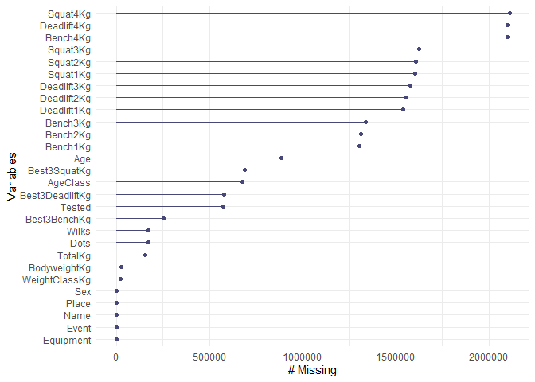
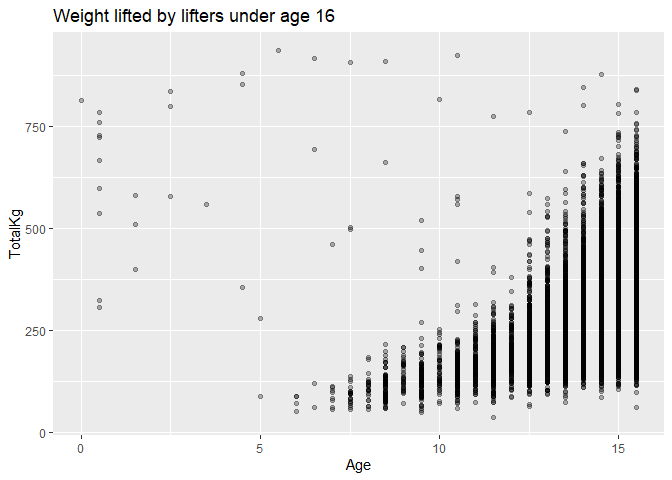
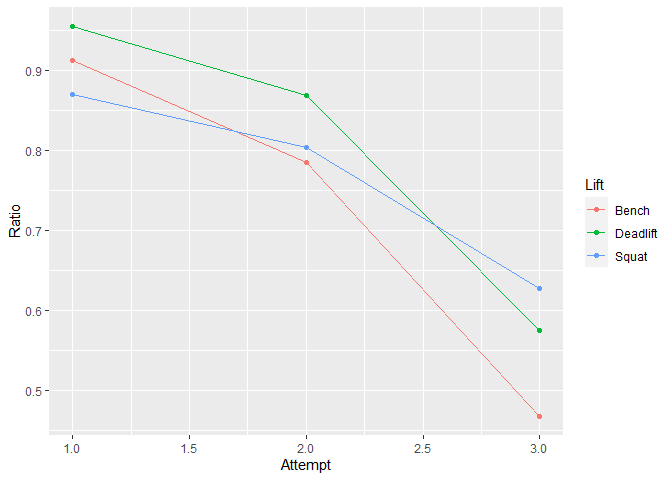
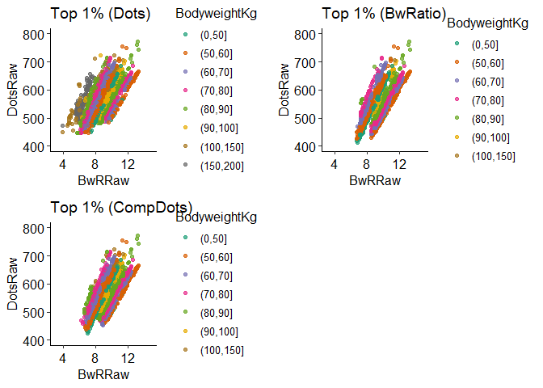
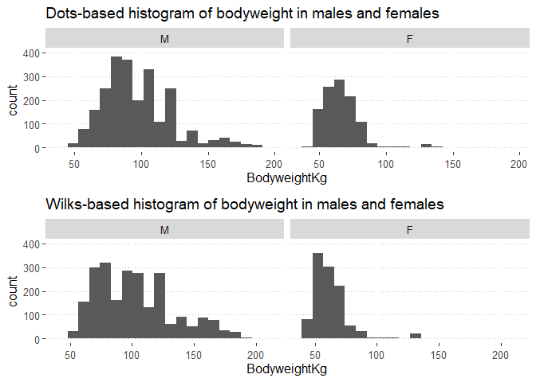
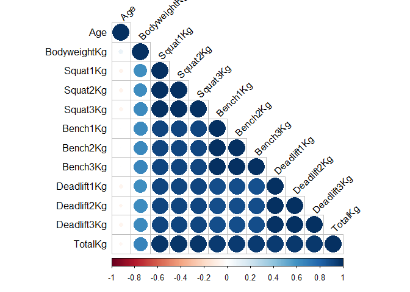

Powerlifting calculator
================
For the past few years I have been doing a powerlifting style of
strength training. One of the most important factors in powerlifting is
determining how much weight you should lift during competition, which
can be a daunting task for newcomers to the sport. In an effort to
remedy this, I have created a calculator to help powerlifting
competitors determine the weight they should lift in order to maximize
their performance. Powerlifting meets/competitions have a simple
structure: there are three lifts, squat/bench press/deadlift, and for
each lift you have three attempts to lift the highest weight possible.

## Table of contents

1.  [Project Summary](#project-summary)
2.  [Data Preparation](#data-preparation)
3.  [Data Visualization](#data-visualization)
4.  [Model Building](#model-building)
5.  [Website Deployment](#website-deployment)

## Project Summary

<ul>

<li>

Created a [website](https://bdt833.shinyapps.io/Powerlifting_Calc/)
using Shiny to help powerlifters predict and visualize their lift
attempts to maximize performance

</li>

<li>

Discovered that bench press attempts are 10-15% more likely to fail on
average as compared with squat or deadlift, suggesting bench press
requires better training or better strategy in competition

</li>

<li>

Feature engineered metrics to judge overall strength of lifters by
combining two standard benchmarks, Wilks/Dots coefficient and weight
lifted:bodyweight ratio

</li>

<li>

Optimized Linear, Elastic Net, and Random Forest regressors using
Tidymodels to choose the most accurate predictive model

</li>

</ul>

## Data Preparation

Open Powerlifting is a great platform that collects global data on
powerlifting meets, hosted
[here](https://github.com/sstangl/openpowerlifting-static/raw/gh-pages/openpowerlifting-latest.zip).
Data was extracted and loaded into R:

``` r
library(tidyverse)
library(naniar)

powerlifting <- read_csv("openpowerlifting-2020-10-16.csv", 
                         col_types = "cfffdfffdfddddddddddddddddfddddffffDffff")

#convert to data.frame to view non-truncated results
miss_var_summary(powerlifting) %>% as.data.frame() 
```

    ##            variable  n_miss   pct_miss
    ## 1          Squat4Kg 2110489 99.7385659
    ## 2       Deadlift4Kg 2101762 99.3261409
    ## 3          Bench4Kg 2101176 99.2984474
    ## 4          Squat3Kg 1624863 76.7886046
    ## 5          Squat2Kg 1609760 76.0748594
    ## 6          Squat1Kg 1603646 75.7859208
    ## 7       Deadlift3Kg 1577455 74.5481732
    ## 8       Deadlift2Kg 1550635 73.2807000
    ## 9       Deadlift1Kg 1538770 72.7199777
    ## 10         Bench3Kg 1340146 63.3333034
    ## 11         Bench2Kg 1313809 62.0886560
    ## 12         Bench1Kg 1303229 61.5886610
    ## 13          Country 1042303 49.2576870
    ## 14              Age  886464 41.8929680
    ## 15   BirthYearClass  831286 39.2853379
    ## 16 ParentFederation  811616 38.3557630
    ## 17     Best3SquatKg  688194 32.5230232
    ## 18         AgeClass  678603 32.0697668
    ## 19        MeetState  584444 27.6199527
    ## 20  Best3DeadliftKg  579130 27.3688210
    ## 21           Tested  574609 27.1551653
    ## 22         Goodlift  337146 15.9330177
    ## 23         MeetTown  255475 12.0733679
    ## 24     Best3BenchKg  252501 11.9328211
    ## 25             Dots  173514  8.2000131
    ## 26            Wilks  173514  8.2000131
    ## 27     Glossbrenner  173514  8.2000131
    ## 28          TotalKg  154561  7.3043226
    ## 29     BodyweightKg   28921  1.3667634
    ## 30    WeightClassKg   24481  1.1569356
    ## 31         Division    2694  0.1273144
    ## 32             Name       0  0.0000000
    ## 33              Sex       0  0.0000000
    ## 34            Event       0  0.0000000
    ## 35        Equipment       0  0.0000000
    ## 36            Place       0  0.0000000
    ## 37       Federation       0  0.0000000
    ## 38             Date       0  0.0000000
    ## 39      MeetCountry       0  0.0000000
    ## 40         MeetName       0  0.0000000

This shows us that some identifier variables (Name, Sex, Event, Date,
etc) have no missing data, but there is a substantial amount of missing
data in other descriptors. Luckily, a large majority of these features
are not of interest, so I’ll drop the irrelevant ones:

``` r
pl_filter <- powerlifting %>% select(-Country, -BirthYearClass, -Federation, 
                                     -MeetCountry, -MeetState, -MeetName, -Goodlift, 
                                     -Glossbrenner, -Division, -ParentFederation, -MeetTown)

#check missing data again, this time using both graphical and textual representations
miss_var_summary(pl_filter) %>% as.data.frame()
```

    ##           variable  n_miss  pct_miss
    ## 1         Squat4Kg 2110489 99.738566
    ## 2      Deadlift4Kg 2101762 99.326141
    ## 3         Bench4Kg 2101176 99.298447
    ## 4         Squat3Kg 1624863 76.788605
    ## 5         Squat2Kg 1609760 76.074859
    ## 6         Squat1Kg 1603646 75.785921
    ## 7      Deadlift3Kg 1577455 74.548173
    ## 8      Deadlift2Kg 1550635 73.280700
    ## 9      Deadlift1Kg 1538770 72.719978
    ## 10        Bench3Kg 1340146 63.333303
    ## 11        Bench2Kg 1313809 62.088656
    ## 12        Bench1Kg 1303229 61.588661
    ## 13             Age  886464 41.892968
    ## 14    Best3SquatKg  688194 32.523023
    ## 15        AgeClass  678603 32.069767
    ## 16 Best3DeadliftKg  579130 27.368821
    ## 17          Tested  574609 27.155165
    ## 18    Best3BenchKg  252501 11.932821
    ## 19            Dots  173514  8.200013
    ## 20           Wilks  173514  8.200013
    ## 21         TotalKg  154561  7.304323
    ## 22    BodyweightKg   28921  1.366763
    ## 23   WeightClassKg   24481  1.156936
    ## 24            Name       0  0.000000
    ## 25             Sex       0  0.000000
    ## 26           Event       0  0.000000
    ## 27       Equipment       0  0.000000
    ## 28           Place       0  0.000000
    ## 29            Date       0  0.000000

``` r
gg_miss_var(pl_filter)
```

<!-- -->

Of the remaining features, the individual lift attempts comprise a
majority of the missing data. This is because much of the data only
includes TotalKg lifted. Unfortunately, it is impossible to impute
missing values for those individual lifts. Since I am only interested in
the “SBD” event that includes data for all three squat, bench press, and
deadlift attempts, I will simply drop the lift attempts with missing
values.

``` r
pl_filter2 <- pl_filter %>% filter(Event == "SBD") %>% 
  filter(is.na(Squat1Kg) == F, is.na(Bench1Kg) == F, is.na(Deadlift1Kg) == F) %>%
  filter(is.na(Squat2Kg) == F, is.na(Bench2Kg) == F, is.na(Deadlift2Kg) == F) %>% 
  filter(is.na(Squat3Kg) == F, is.na(Bench3Kg) == F, is.na(Deadlift3Kg) == F) %>%
  filter(is.na(Best3SquatKg) == F, is.na(Best3BenchKg) == F, is.na(Best3DeadliftKg) == F) %>% 
  filter(Place != "DQ", Place != "DD", Place != "NS") %>% #remove no-shows/disqualified lifters 
  select(-Event, -Place)

nrow(pl_filter2)/nrow(pl_filter) #only 20% of the data remains
```

    ## [1] 0.2017352

With the lift attempt data cleaned up, let’s check the summary
statistics and go from there:

``` r
summary(pl_filter2)
```

    ##      Name           Sex              Equipment           Age       
    ##  Length:426876      M :294055   Single-ply:112305   Min.   : 0.00  
    ##  Class :character   F :132811   Multi-ply : 17153   1st Qu.:20.50  
    ##  Mode  :character   Mx:    10   Unlimited :     6   Median :25.50  
    ##                                 Wraps     : 59791   Mean   :29.21  
    ##                                 Raw       :237621   3rd Qu.:35.00  
    ##                                 Straps    :     0   Max.   :92.50  
    ##                                                     NA's   :63060  
    ##     AgeClass       BodyweightKg    WeightClassKg       Squat1Kg     
    ##  24-34  :125471   Min.   : 19.00   93     : 30798   Min.   :-500.0  
    ##  20-23  : 81079   1st Qu.: 66.50   83     : 29638   1st Qu.:  92.5  
    ##  18-19  : 35141   Median : 81.10   90     : 26627   Median : 145.0  
    ##  35-39  : 26278   Mean   : 82.67   82.5   : 26009   Mean   : 120.3  
    ##  16-17  : 25461   3rd Qu.: 95.80   75     : 24934   3rd Qu.: 200.0  
    ##  (Other): 79997   Max.   :244.40   (Other):287353   Max.   : 555.0  
    ##  NA's   : 53449   NA's   :535      NA's   :  1517                   
    ##     Squat2Kg         Squat3Kg          Squat4Kg       Best3SquatKg  
    ##  Min.   :-580.0   Min.   :-600.50   Min.   :-550.0   Min.   : 10.0  
    ##  1st Qu.:  82.5   1st Qu.:-150.00   1st Qu.:-158.1   1st Qu.:125.0  
    ##  Median : 145.0   Median : 115.00   Median : 105.0   Median :175.0  
    ##  Mean   : 102.7   Mean   :  42.04   Mean   :  27.2   Mean   :178.8  
    ##  3rd Qu.: 202.5   3rd Qu.: 192.50   3rd Qu.: 182.5   3rd Qu.:222.5  
    ##  Max.   : 547.5   Max.   : 552.50   Max.   : 505.5   Max.   :555.0  
    ##                                     NA's   :423961                  
    ##     Bench1Kg          Bench2Kg          Bench3Kg           Bench4Kg     
    ##  Min.   :-425.50   Min.   :-575.00   Min.   :-575.000   Min.   :-440.0  
    ##  1st Qu.:  57.50   1st Qu.:  45.00   1st Qu.:-120.000   1st Qu.:-128.0  
    ##  Median : 100.00   Median :  92.50   Median : -50.000   Median : -50.0  
    ##  Mean   :  86.92   Mean   :  64.16   Mean   :  -6.463   Mean   :  -7.3  
    ##  3rd Qu.: 135.00   3rd Qu.: 135.00   3rd Qu.: 115.000   3rd Qu.: 117.5  
    ##  Max.   : 425.00   Max.   : 385.00   Max.   : 425.500   Max.   : 330.0  
    ##                                                         NA's   :424235  
    ##   Best3BenchKg    Deadlift1Kg      Deadlift2Kg      Deadlift3Kg     
    ##  Min.   :  6.8   Min.   :-390.0   Min.   :-435.0   Min.   :-587.50  
    ##  1st Qu.: 72.5   1st Qu.: 125.0   1st Qu.: 120.0   1st Qu.:-202.50  
    ##  Median :113.4   Median : 180.0   Median : 177.5   Median : 120.00  
    ##  Mean   :115.4   Mean   : 164.2   Mean   : 138.4   Mean   :  20.34  
    ##  3rd Qu.:147.5   3rd Qu.: 220.0   3rd Qu.: 230.0   3rd Qu.: 205.00  
    ##  Max.   :425.5   Max.   : 415.0   Max.   : 433.5   Max.   : 432.50  
    ##                                                                     
    ##   Deadlift4Kg     Best3DeadliftKg    TotalKg            Dots       
    ##  Min.   :-440.0   Min.   : 15.9   Min.   :  38.6   Min.   : 28.36  
    ##  1st Qu.:-190.0   1st Qu.:147.5   1st Qu.: 347.5   1st Qu.:308.16  
    ##  Median : 117.5   Median :200.0   Median : 490.0   Median :359.47  
    ##  Mean   :  18.3   Mean   :197.5   Mean   : 491.8   Mean   :363.39  
    ##  3rd Qu.: 190.0   3rd Qu.:241.0   3rd Qu.: 610.0   3rd Qu.:414.45  
    ##  Max.   : 440.5   Max.   :433.5   Max.   :1275.5   Max.   :771.36  
    ##  NA's   :422603                                    NA's   :535     
    ##      Wilks         Tested            Date           
    ##  Min.   : 28.23   Yes :330066   Min.   :1967-09-02  
    ##  1st Qu.:306.61   NA's: 96810   1st Qu.:2013-04-29  
    ##  Median :357.68                 Median :2016-12-11  
    ##  Mean   :361.76                 Mean   :2014-07-28  
    ##  3rd Qu.:412.57                 3rd Qu.:2018-11-25  
    ##  Max.   :765.33                 Max.   :2020-10-11  
    ##  NA's   :535

``` r
#remove data categories with too low of a sample size and do some feature engineering
pl_filter3 <- pl_filter2 %>% 
  mutate(Tested = as.factor(ifelse(is.na(Tested) == F, "Yes", "No"))) %>% #NA values = untested
  filter((Equipment != "Straps" & Equipment != "Unlimited"), Sex != "Mx") %>% 
  mutate(Squat2J = (abs(Squat2Kg) - abs(Squat1Kg))) %>% #variables to show attempt 1->2 jump
  mutate(Bench2J = (abs(Bench2Kg) - abs(Bench1Kg))) %>% 
  mutate(Dead2J = (abs(Deadlift2Kg) - abs(Deadlift1Kg))) %>%
  mutate(Squat3J = (abs(Squat3Kg) - abs(Squat2Kg))) %>% #same but with attempt 2 to 3
  mutate(Bench3J = (abs(Bench3Kg) - abs(Bench2Kg))) %>% 
  mutate(Dead3J = (abs(Deadlift3Kg) - abs(Deadlift2Kg))) %>%
  mutate(Squat1SF = ifelse(Squat1Kg > 0, 1, 0), 
         Squat2SF = ifelse(Squat2Kg > 0, 1, 0), 
         Squat3SF = ifelse(Squat3Kg > 0, 1, 0)) %>% #dummy variable for success of lift
  mutate(Bench1SF = ifelse(Bench1Kg > 0, 1, 0), 
         Bench2SF = ifelse(Bench2Kg > 0, 1, 0), 
         Bench3SF = ifelse(Bench3Kg > 0, 1, 0)) %>%
  mutate(Deadlift1SF = ifelse(Deadlift1Kg > 0, 1, 0), 
         Deadlift2SF = ifelse(Deadlift2Kg > 0, 1, 0), 
         Deadlift3SF = ifelse(Deadlift3Kg > 0, 1, 0)) %>%
  mutate_at(c("Squat1Kg", "Squat2Kg", "Squat3Kg", 
              "Bench1Kg", "Bench2Kg", "Bench3Kg", 
              "Deadlift1Kg", "Deadlift2Kg", "Deadlift3Kg"), ~abs(.)) #change all to positive

#refactor Sex, Equipment groups
pl_filter3$Sex <- factor(pl_filter3$Sex)
pl_filter3$Equipment <- factor(pl_filter3$Equipment)
```

There are some entries without an age, age class, bodyweight, or weight
class. I could potentially impute the data from age class and weight
class, or vice versa, but I will simply drop age/weight class and
missing bodyweight values. There are a substantial number of “ageless”
competitors, so I will use an indicator number of age = 0 for those with
missing values. Further, there are some typos or data entry issues that
I will need to filter out.

``` r
pl_filter3 %>% filter(Age < 16) %>% ggplot(aes(Age, TotalKg)) + 
  geom_point(alpha = 0.3) + 
  ggtitle("Weight lifted by lifters under age 16")
```

<!-- -->

It’s a bit unrealistic (but not impossible) for lifters under 16 to have
lifted over 500kg. It’s also obvious that there are some data entry
errors, with some strong 1 year-olds having lifted over 750kg. I’ll
change the age of anyone under 16 to have age = 0 to prevent these data
from impacting the model later on.

In addition, I will create a bodyweight ratio variable and scale
bodyweight ratio, Wilks score, and Dots score so as to be comparable to
each other. Then, I create a compiled Dots and compiled Wilks score by
averaging the scaled bodyweight ratio and respective score value. The
Wilks and Dots scores are coefficients used to compare lifters among
different weightclasses and genders, and a higher number is better.
There has been [recent
research](https://drive.google.com/drive/folders/1-0rE_GbYWVum7U1UfpR0XWiFR9ZNbXWJ)
showing that Dots score is a fairer metric, but I have included both in
order to compare them later.

``` r
#change any NAs to 0 and change any lifter under age 16 to have age = 0 
pl_filter3$Age[is.na(pl_filter3$Age) == T] <- 0
pl_filter3$Age[pl_filter3$Age < 16] <- 0

pl_filter4 <- pl_filter3 %>% select(-AgeClass, -WeightClassKg) %>%
  filter(!is.na(BodyweightKg) == T, !is.na(TotalKg) == T) %>%
  filter(Squat2J < 100, Bench2J < 100, Dead2J < 100) %>% #unlikely that anyone will jump 100kg+ 
  filter(Squat3J < 100, Bench3J < 100, Dead3J < 100) %>%
  mutate(BwRatio = TotalKg / BodyweightKg) %>% #weight lifted:bodyweight ratio
  mutate(WilksRaw = Wilks, BwRRaw = BwRatio, DotsRaw = Dots) %>% 
  mutate_at(c("Wilks", "BwRatio", "Dots"), 
            ~(scale(.) %>% as.vector)) %>% #scale Wilks/Dots/BwRatio and save the raw values
  mutate(CompWilks = (Wilks + BwRatio)/2, CompDots = (Dots + BwRatio)/2) #create a composite score  

miss_var_summary(pl_filter4)
```

    ## # A tibble: 46 x 3
    ##    variable     n_miss pct_miss
    ##    <chr>         <int>    <dbl>
    ##  1 Bench4Kg     423332     99.4
    ##  2 Squat4Kg     423059     99.3
    ##  3 Deadlift4Kg  421699     99.0
    ##  4 Name              0      0  
    ##  5 Sex               0      0  
    ##  6 Equipment         0      0  
    ##  7 Age               0      0  
    ##  8 BodyweightKg      0      0  
    ##  9 Squat1Kg          0      0  
    ## 10 Squat2Kg          0      0  
    ## # ... with 36 more rows

``` r
#some minor feature engineering left
pl_noage <- pl_filter4 %>% filter(Age == 0)

pl_final <- pl_filter4 %>% filter(Age != 0)
```

Finally\! The data is looking nice and clean except for attempt 4.
Typically there are only three attempts per lift, but lifters may be
given a fourth attempt in order to break a world record. These numbers
will be left in for now. Now, onto some visualizations about lift
success and elite level powerlifters.

## Data Visualization

First, I want to see the overall success rate of each lift for the three
attempts in competition. Below is the code outlining that:

``` r
library(ggplot2)
library(ggpubr)
#find the success rate of each lift for each attempt
lifts_SF <- as_tibble(as.data.frame(matrix(c(mean(pl_final$Squat1SF), mean(pl_final$Bench1SF), 
                                             mean(pl_final$Deadlift1SF), mean(pl_final$Squat2SF), 
                                             mean(pl_final$Bench2SF), mean(pl_final$Deadlift2SF), 
                                             mean(pl_final$Squat3SF), mean(pl_final$Bench3SF), 
                                             mean(pl_final$Deadlift3SF)),
                             byrow = T, nrow = 3)))
lifts_SF <- lifts_SF %>% gather("Lift", "Ratio")
lifts_SF$Lift <- c(rep("Squat", 3), rep("Bench", 3), rep("Deadlift", 3))
lifts_SF$Attempt <- rep(c(1,2,3), 3)

#plot
lifts_SF %>% ggplot(aes(Attempt, Ratio, col = Lift)) + 
  geom_point() + 
  geom_line()
```

<!-- -->

It looks like on attempts 1 and 2, the lifts’ success ratios are fairly
balanced. Bench press suffers from a much lower success ratio on lift 3,
though. Bench press is the most technical lift among the three in my
opinion, and is most likely to fail at maximal weights. This could
explain the discrepancy in success on lift 3, but to me it indicates
that lifters should aim for a more conservative final attempt and tailor
their strategy accordingly.

Next, I will look at the top 0.1% of powerlifters, sorted by either the
scaled Dots coefficient, scaled bodyweight ratio, or the compiled Dots
score. I will create scatterplots of bodyweight ratio vs Dots score in
order to compare how well these metrics generalize across the population
of lifters. I will check if these metrics include from all ranges of
weight classes as a measure to see how fair they are.

``` r
#find the top 1% of powerlifters ordered  by Dots, BwRatio, and CompDots
pl_top01_Dots <- pl_final %>% 
  group_by(Sex, Tested, Equipment) %>% 
  slice_max(order_by = Dots, prop = 0.01) %>% 
  ungroup 

pl_top01_BwRatio <- pl_final %>% 
  group_by(Sex, Tested, Equipment) %>% 
  slice_max(order_by = BwRatio, prop = 0.01) %>% 
  ungroup 

pl_top01_CompDots <- pl_final %>% 
  group_by(Sex, Tested, Equipment) %>% 
  slice_max(order_by = CompDots, prop = 0.01) %>% 
  ungroup 

#create scatterplots of BwRatio vs Dots raw scores
top01_Dots_plot <- pl_top01_Dots %>% 
  ggplot(aes(BwRRaw, DotsRaw, col = cut(BodyweightKg, c(0, 50, 60, 70, 80, 90, 100, 150, 200)))) + 
  geom_point(alpha = 0.7) + 
  scale_color_brewer(palette = "Dark2", name = "BodyweightKg") + 
  xlim(3,15) + ylim(400, 800) + theme_pubr(legend = "right") + ggtitle("Top 1% (Dots)")

top01_BwRatio_plot <- pl_top01_BwRatio %>% 
  ggplot(aes(BwRRaw, DotsRaw, col = cut(BodyweightKg, c(0, 50, 60, 70, 80, 90, 100, 150, 200)))) + 
  geom_point(alpha = 0.7) + 
  scale_color_brewer(palette = "Dark2", name = "BodyweightKg") +  
  xlim(3,15) + ylim(400, 800) + theme_pubr(legend = "right") +ggtitle("Top 1% (BwRatio)")

top01_CompDots_plot <- pl_top01_CompDots %>% 
  ggplot(aes(BwRRaw, DotsRaw, col = cut(BodyweightKg, c(0, 50, 60, 70, 80, 90, 100, 150, 200)))) + 
  geom_point(alpha = 0.7) + 
  scale_color_brewer(palette = "Dark2", name = "BodyweightKg") +  
  xlim(3,15) + ylim(400, 800) + theme_pubr(legend = "right") + ggtitle("Top 1% (CompDots)")

#combine all plots together
ggarrange(top01_Dots_plot, top01_BwRatio_plot, top01_CompDots_plot)
```

<!-- -->

I created bins for bodyweight and fixed the x- and y- axes in order to
ensure that the scales and legend would be the same between plots. The
top 1% Dots category is populated by more heavyweight competitors
(100kg+), while the BwRatio category has almost none. The CompDots plot
shows a mix between the Dots and BwRatio categories, with there being
more heavyweight lifters included. The CompDots category is more
balanced, showing that it is a good compromise between using either the
Dots score or bodyweight ratio metric. One obvious insight from these
plots is that lifters who have a higher bodyweight ratio metric will
tend to be rated as better powerlifters overall.

I mentioned earlier that Wilks and Dots coefficients are used in the
same manner to compare the strength of lifters. One of the arguments for
usage of the Dots score instead of the Wilks score is the Wilks score’s
tendency to favor [heavier males and lighter
females](http://ubercruzer.com/2019/02/25/is-the-ipf-points-formula-better-than-the-wilks-coefficient/).
I want to see if this is observed from the data:

``` r
#create a Wilks-based top 1% list, similar to Dots
pl_top01_Wilks <- pl_final %>% 
  group_by(Sex, Tested, Equipment) %>% 
  slice_max(order_by = Wilks, prop = 0.01) %>% 
  ungroup 

#create simple histograms and boxplots of BodyweightKg
Wilks_hist <- pl_top01_Wilks %>% ggplot(aes(BodyweightKg)) + 
  geom_histogram(bins = 20) + facet_wrap(~ Sex) + ylim(0, 400) +
  theme_pubclean() + ggtitle("Wilks-based histogram of bodyweight in males and females")

Dots_hist <- pl_top01_Dots %>% ggplot(aes(BodyweightKg)) + 
  geom_histogram(bins = 20) + facet_wrap(~ Sex) + ylim(0, 400) +
  theme_pubclean() + ggtitle("Dots-based histogram of bodyweight in males and females")

ggarrange(Dots_hist, Wilks_hist, nrow = 2)
```

<!-- -->

There is obviously a shift in distributions of bodyweight in Dots
compared to Wilks. We can see that the Dots metric has its median
shifted to the left, with a thinner right tail encompassing fewer heavy
males. The Dots-based score shifts the median to the right in females,
away from the Wilks bias towards lighter females. This helps to
reinforce the notion that Dots is a fairer metric than Wilks across
weight classes and genders.

Next, I will look at the top 0.1% of powerlifters separated by the
Equipment category and look at their strength metrics. As found above,
CompDots seems to be the fairest metric for comparing powerlifters, so I
will be using it to highlight the top 0.1% of lifters.

``` r
#find the top 0.1% of powerlifters for each of the categories below, measured by compiled Dots score 
pl_top001 <- pl_final %>% 
  group_by(Sex, Tested, Equipment) %>% 
  slice_max(order_by = CompDots, prop = 0.001) %>% 
  ungroup 

#list of top lifters in raw category
pl_top001 %>% filter(Equipment == "Raw") %>%
  select(Name, CompDots, Dots, BwRatio, BodyweightKg, DotsRaw, BwRRaw) %>% 
  arrange(desc(CompDots)) %>% 
  print(n=30)
```

    ## # A tibble: 194 x 7
    ##    Name               CompDots  Dots BwRatio BodyweightKg DotsRaw BwRRaw
    ##    <chr>                 <dbl> <dbl>   <dbl>        <dbl>   <dbl>  <dbl>
    ##  1 Andrzej Stanaszek      3.18  2.69    3.67         51.3    582.  11.7 
    ##  2 Sergey Fedosienko      3.07  2.63    3.51         58.5    577.  11.4 
    ##  3 Andrzej Stanaszek      3.04  2.55    3.53         51.4    571.  11.5 
    ##  4 Andrzej Stanaszek      3.04  2.55    3.52         51.2    571.  11.5 
    ##  5 Sergey Fedosienko      3.01  2.56    3.45         58.2    572.  11.4 
    ##  6 Andrzej Stanaszek      3.00  2.51    3.49         50.6    568.  11.4 
    ##  7 Sergey Fedosienko      2.99  2.55    3.43         58.6    571.  11.3 
    ##  8 Andrzej Stanaszek      2.97  2.48    3.46         49.9    566.  11.4 
    ##  9 Sergey Fedosienko      2.97  2.53    3.41         58.4    570.  11.3 
    ## 10 Sergey Fedosienko      2.97  2.52    3.41         57.6    569.  11.3 
    ## 11 Sergey Fedosienko      2.96  2.52    3.40         58.2    568.  11.3 
    ## 12 Marianna Gasparyan     2.95  3.40    2.50         56      640.   9.87
    ## 13 John Haack             2.94  3.00    2.88         89.6    608.  10.5 
    ## 14 John Haack             2.89  2.95    2.84         89.7    604.  10.4 
    ## 15 Michael Estrella       2.87  2.54    3.20         67.3    570.  11.0 
    ## 16 Andrzej Stanaszek      2.87  2.38    3.35         50.2    557.  11.2 
    ## 17 Andrzej Stanaszek      2.85  2.38    3.33         52.8    557.  11.2 
    ## 18 Jesse Norris           2.82  2.87    2.76         89.7    597.  10.3 
    ## 19 Taylor Atwood          2.81  2.58    3.04         73.8    573.  10.7 
    ## 20 Taylor Atwood          2.80  2.57    3.04         73.5    573.  10.7 
    ## 21 Andrzej Stanaszek      2.78  2.30    3.26         51.3    551.  11.1 
    ## 22 Andrzej Stanaszek      2.77  2.29    3.25         51.6    550.  11.0 
    ## 23 Andrzej Stanaszek      2.76  2.28    3.24         51.4    549.  11.0 
    ## 24 Michael Estrella       2.74  2.40    3.07         67.1    559.  10.8 
    ## 25 Keith McHoney          2.73  2.41    3.05         68.3    560.  10.7 
    ## 26 Stefanie Cohen         2.72  3.12    2.31         54.8    617.   9.58
    ## 27 Jawon Garrison         2.71  2.62    2.80         82.2    577.  10.3 
    ## 28 Charles Okpoko         2.70  2.34    3.05         65.8    554.  10.7 
    ## 29 Sergey Fedosienko      2.69  2.25    3.12         58.6    547.  10.8 
    ## 30 Taylor Atwood          2.67  2.44    2.91         73.8    562.  10.5 
    ## # ... with 164 more rows

I am focusing on the raw category, and there are a few interesting
things to note. The top two athletes in this class are both dwarfs.
Their lower body weight, range of motion, and better leverage allow for
some incredibly impressive lifts. We also know from above that lifters
with a higher bodyweight ratio tend to dominate the upper echelons of
powerlifting. The top 30 powerlifters all have a bodyweight ratio \>= 10
except for two people, Marianna Gasparyan and Stefanie Cohen. Gasparyan
and Cohen are notably world record-holding female powerlifters with the
two highest Dots scores in the top 30. In fact, if we look at the top 5
Dots scores overall, both of these lifters are included.

``` r
pl_top001 %>% filter(Equipment == "Raw") %>% 
  arrange(desc(DotsRaw)) %>% 
  select(Name, DotsRaw, BwRRaw) %>% 
  print(n = 5)
```

    ## # A tibble: 194 x 3
    ##   Name                DotsRaw BwRRaw
    ##   <chr>                 <dbl>  <dbl>
    ## 1 Marianna Gasparyan     640.   9.87
    ## 2 Kristy Hawkins         632.   8.70
    ## 3 Kristy Hawkins         631.   8.69
    ## 4 Hunter Henderson #1    625.   8.57
    ## 5 Stefanie Cohen         617.   9.58
    ## # ... with 189 more rows

This goes to show that a metric for comparing bodyweight ratio and Dots
coefficient, such as the CompDots score, is necessary to get a clear
picture of powerlifters’ relative strengths.

## Model Building

Before doing any modeling, I want to take a look at the data’s
correlation matrix, as shown below.

``` r
library(corrplot)
#select only independent variables of interest for correlation analysis
pl_corr <- pl_final %>% select(Age, BodyweightKg, Squat1Kg, Squat2Kg, 
                               Squat3Kg, Bench1Kg, Bench2Kg, Bench3Kg, 
                               Deadlift1Kg, Deadlift2Kg, Deadlift3Kg, TotalKg)
pl_cor_matrix <- cor(pl_corr)

corrplot(pl_cor_matrix, type = "lower", tl.col = "black", tl.srt = 45)
```

<!-- -->

Except age, this data is all correlated and the data in each lift
category are highly linear. Simple linear regression, elastic net
regression, and random forest regression are three common algorithms
employed in predictive modeling. I will use the squat data to evaluate
predictive model performance on the three lifts categories. In doing so,
a smaller subset of data using only successful lifts will be used for
predicting, as I want to create models to emulate the most successful
powerlifters. The regressive models will be fit using R’s tidymodels
library, which acts as a unified modeling framework similar to Python’s
scikit-learn.

``` r
library(tidymodels)
pl_model <- pl_final %>% 
  filter(Squat1SF == 1, Squat2SF == 1, 
         Bench1SF == 1, Bench2SF == 1, 
         Deadlift1SF == 1, Deadlift2SF == 1)

#create split data included train and test sets
set.seed(2222)
pl_split <- initial_split(pl_model, strata = Equipment)
pl_train <- training(pl_split)
pl_test <- testing(pl_split)

#create 10-fold cross-validation set
set.seed(4444)
pl_cv_fold <- vfold_cv(pl_train, v = 10)

#create a recipe
S1Kg_rcp <- recipe(Squat1Kg ~ Squat3Kg + Age + Sex + 
                     BodyweightKg + Equipment, data = pl_train_small) %>%
  step_dummy(all_nominal(), -all_outcomes())

#start with linear model
lm_model <- linear_reg() %>%
  set_engine("lm")

#create workflow for model

S1Kg_wf_lm <- workflow() %>%
  add_model(lm_model) %>%
  add_recipe(S1Kg_rcp)

#fitting the 10-fold cv data into the workflow
S1Kg_resamples_lm <- S1Kg_wf_lm %>%
  fit_resamples(pl_cv_fold)

#checking the rmse for LM, which = 6.73
S1Kg_resamples_lm %>% collect_metrics()


#next, the GLM model
glm_model <- linear_reg(penalty = tune(), mixture = tune()) %>% 
  set_engine('glmnet')

glm_wf <- workflow() %>%
  add_model(glm_model) %>%
  add_recipe(S1Kg_rcp)

#create a set of parameters to use for elastic net tuning
glm_set <- parameters(penalty(range = c(-5,1), trans = log10_trans()),
                       mixture())

glm_grid <- grid_regular(glm_set, levels = c(7, 5))
ctrl <- control_grid(save_pred = TRUE, verbose = TRUE)

set.seed(123)
glm_tune <- tune_grid(glm_wf,
            resamples = pl_cv_fold,
            grid = glm_grid,
            metrics = metric_set(rmse),
            control = ctrl)

best_glm <- select_best(glm_tune, metric = "rmse")

#again find the RMSE, this time ~6.75
glm_wf %>% finalize_workflow(best_glm) %>% fit_resamples(pl_cv_fold) %>% collect_metrics()


#random forest model, using the same steps as the LM and extratrees to decrease training time
ranger_model <- rand_forest(seed = 1, splitrule = "extratrees") %>%
  set_engine("ranger") %>%
  set_mode("regression")

ranger_wf <- workflow() %>%
  add_model(pl_ranger) %>%
  add_recipe(S1Kg_rcp)

#rmse is 16.4 this time, which is pretty bad; with its low speed, RF will not be considered
ranger_wf %>% fit_resamples(pl_cv_fold) %>% collect_metrics()
```

Elastic net and linear regression have similar results of RMSE ≈ 6.75,
while random forests are a lot more error-prone with RMSE = 16.4 under
default settings. Random forests are slow to train on this data set, and
I do not require information about variable importance, so I forgo any
further tuning of the model. Elastic net and linear regression give the
same results, but linear regression was the model I used because it is
the fastest and simplest to fit and train. These models were only
evaluated for predicting Squat1Kg, but due to the highly correlated
nature of the data, it is safe to employ the same model framework for
predicting the others lift attempts.

Having said all of this, the linear model is almost superfluous; the
lifts can generally (and more simply) be calculated by taking 90% and
95% of attempt 3 to calculate attempt 1 and 2, respectively. The reason
why I say *almost* superfluous is because the model captures an
interesting point in that, controlled for attempt 3, female lifters
generally tend to lift heavier weights for attempts 1 and 2.

## Website Deployment

Before deploying the website, models for each attempt need to be fit and
stripped down to reduce disk size. The dataset also needs to be stripped
down. Lastly, I create some additional information to be loaded in with
the Shiny app.

``` r
library(strip) #removes extra baggage from LM models, keeps only predictive information
Squat1Kg_model <- lm(Squat1Kg ~ Squat3Kg + Age + Sex + 
                       BodyweightKg + Equipment, data = pl_model)
Squat1Kg_model <- strip(Squat1Kg_model, keep = "predict")

Squat2Kg_model <- lm(Squat2Kg ~ Squat3Kg + Age + Sex + 
                       BodyweightKg + Equipment, data = pl_model)
Squat2Kg_model <- strip(Squat2Kg_model, keep = "predict")

Bench1Kg_model <- lm(Bench1Kg ~ Bench3Kg + Age + Sex + 
                       BodyweightKg + Equipment, data = pl_model)
Bench1Kg_model <- strip(Bench1Kg_model, keep = "predict")

Bench2Kg_model <- lm(Bench2Kg ~ Bench3Kg + Age + Sex + 
                       BodyweightKg + Equipment, data = pl_model)
Bench2Kg_model <- strip(Bench2Kg_model, keep = "predict")

Deadlift1Kg_model <- lm(Deadlift1Kg ~ Deadlift3Kg + Age + Sex + 
                          BodyweightKg + Equipment, data = pl_model)
Deadlift1Kg_model <- strip(Deadlift1Kg_model, keep = "predict")

Deadlift2Kg_model <- lm(Deadlift2Kg ~ Deadlift3Kg + Age + Sex + 
                          BodyweightKg + Equipment, data = pl_model)
Deadlift2Kg_model <- strip(Deadlift2Kg_model, keep = "predict")

#create initial data.frame with random info
user_info <- setNames(data.frame(20, factor("M"), 70, factor("Single-ply"), 140, 100, 185), 
                      c("Age", "Sex", "BodyweightKg", 
                        "Equipment", "Squat3Kg", "Bench3Kg", "Deadlift3Kg"))

#create full data.frame (includes 0 age group) with only relevant lift information
pl_web_clean <- pl_filter4 %>% select(-Best3SquatKg, -Best3BenchKg, -Best3DeadliftKg, 
                                      -Dots, -Wilks, -Tested, -BwRatio, -WilksRaw, -BwRRaw, 
                                      -DotsRaw, -CompWilks, -CompDots, -Squat2J, -Bench2J, 
                                      -Dead2J, -Squat3J, -Bench3J, -Dead3J, -Squat4Kg, 
                                      -Bench4Kg, -Deadlift4Kg)


#find lifts that only have >100  attempts for that weight to find the common lifts for visualizations
squat_sampsize <- pl_web_clean %>% 
  group_by(Squat3Kg) %>% 
  summarize(Sample_Size = n()) %>% 
  filter(Sample_Size > 100)

bench_sampsize <- pl_web_clean %>% 
  group_by(Bench3Kg) %>% 
  summarize(Sample_Size = n()) %>% 
  filter(Sample_Size > 100)

deadlift_sampsize <- pl_web_clean %>% 
  group_by(Deadlift3Kg) %>% 
  summarize(Sample_Size = n()) %>% 
  filter(Sample_Size > 100)

#create a top 1% lifter group
pl_top01 <- pl_final %>% 
  group_by(Sex, Tested, Equipment) %>% 
  slice_max(order_by = CompDots, prop = 0.01) %>% 
  ungroup %>% select(Name, Sex, Equipment, Age, BodyweightKg, Squat4Kg, 
                     Best3SquatKg, Bench4Kg, Best3BenchKg, Deadlift4Kg, 
                     Best3DeadliftKg, TotalKg, DotsRaw, BwRRaw, CompDots, Tested) 

#save this as an .RData file to be loaded into the web app
save(Squat1Kg_model, Squat2Kg_model, Bench1Kg_model, Bench2Kg_model, Deadlift1Kg_model, 
     Deadlift2Kg_model, pl_web_clean, squat_sampsize, bench_sampsize, deadlift_sampsize, 
     user_info, pl_top01, file = "PL_Web.RData")
```

The dataset pl\_web\_clean has data from the age = 0 group of lifters,
but this information is used only for plotting lift information and
calculating success rate of certain lifts.
